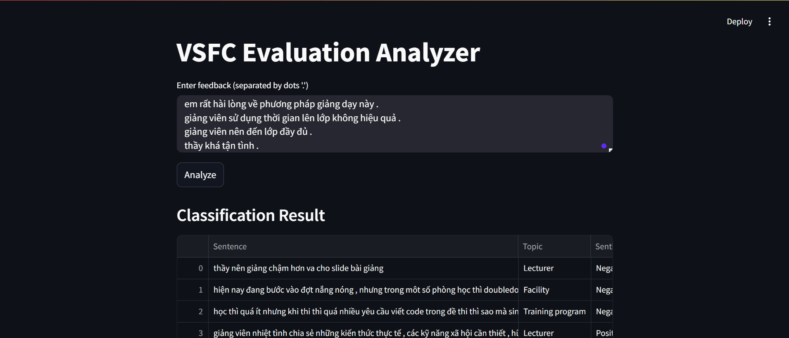
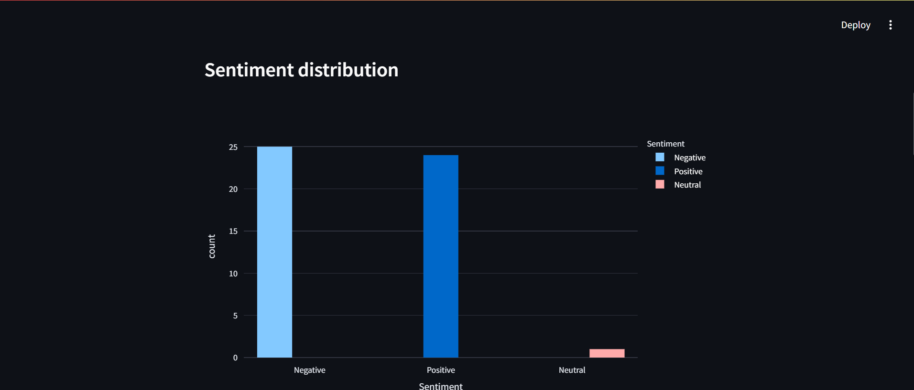
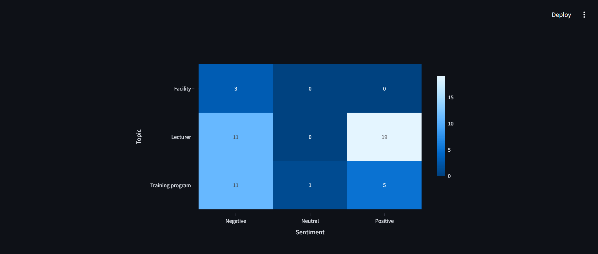

# Vietnamese Student Feedback Classification (VSFC) Analyzer

## Project Overview

VSFC Analyzer is a Streamlit web application for fine-grained analysis of Vietnamese student feedback. It classifies sentences by **sentiment** (Negative, Neutral, Positive) and **topic** (Lecturer, Training Program, Facility, Others) using Transformer models fine-tuned on domain-specific data.

The app features interactive visualizations, including sentiment/topic distributions and heatmaps, to provide actionable insights for educational stakeholders.

## Features

- Sentence-level sentiment and topic classification  
- Interactive data visualization with Plotly (histograms, heatmaps)  
- Model loading dynamically from Hugging Face Hub, minimizing repo size  
- Easy local setup with Python virtual environment  

## Installation

### Prerequisites

- Python 3.8 or higher  
- pip package manager  
- Optional: CUDA-enabled GPU for faster inference  

### Setup Steps

```bash
git clone https://github.com/TMTien31/VSFC-Analyzer
cd VSFC-Analyzer

python -m venv venv
# Activate virtual environment:
# Linux/macOS: source venv/bin/activate
# Windows: venv\Scripts\activate.bat

pip install -r requirements.txt
```

## Running the Application

```bash
streamlit run app.py
```

Then open your browser at [http://localhost:8501](http://localhost:8501).

## Model Information

Models are hosted on Hugging Face and loaded dynamically during runtime. No large model files are stored in this repository.

| Model     | Hugging Face URL                                                            |
| --------- | --------------------------------------------------------------------------- |
| Sentiment | [VSFC-sentiment-classify-phoBERT](https://huggingface.co/tmt3103/VSFC-sentiment-classify-phoBERT) |
| Topic     | [VSFC-topic-classify-phoBERT](https://huggingface.co/tmt3103/VSFC-topic-classify-phoBERT)         |

## Evaluation Metrics

| Model     | Accuracy | F1 Score |
| --------- | -------- | -------- |
| Sentiment | 94.44%   | 94.12%   |
| Topic     | 89.13%   | 89.04%   |

## Project Structure

```
VSFC-Analyzer/
│
├── app.py                   # Main Streamlit app
├── requirements.txt         # Python dependencies
├── utils/
│   ├── predictor.py         # Model loading & prediction logic
│   └── text_utils.py        # Text preprocessing utilities
├── screenshots/
│   ├── app-interface.png
│   ├── sentiment-distribution.png
│   └── heatmap.png
├── .gitignore               # Git ignore rules
└── README.md                # This documentation file
```

## Screenshots

*Example app interface and visualizations:*




